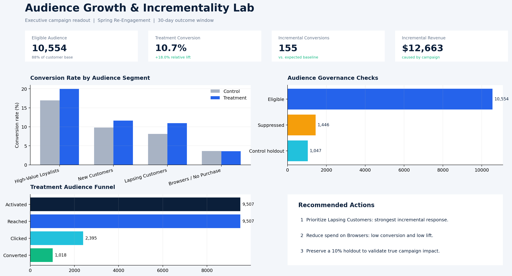
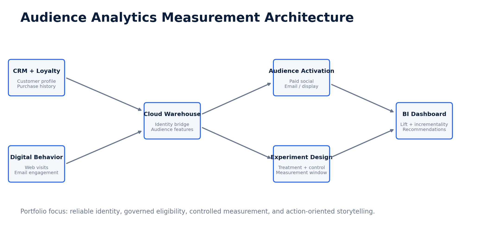

# Audience Growth & Incrementality Lab



## Project overview

This project simulates how a retail marketing analytics team identifies a high-potential audience, applies eligibility and suppression rules, activates a campaign, and measures whether the campaign caused incremental customer behavior.

The analysis goes beyond platform-reported clicks and attributed revenue. A randomized control group establishes the expected conversion baseline, allowing the campaign's true incremental conversions and revenue to be estimated.

## Business question

Which customer audiences should receive additional marketing investment, and how much customer behavior was caused by the campaign rather than activity that would have happened anyway?

## Business scenario

A retail brand plans a spring re-engagement campaign across email and paid media. Marketing needs to:

- Identify eligible customers and apply opt-out and contact-policy suppressions.
- Compare audience segments before activation.
- Reserve a 10% control group for causal measurement.
- Track the campaign funnel from activation through conversion.
- Recommend where to increase, reduce, or test investment.

## Measurement architecture



## Dataset

The dataset contains 12,000 customer-level campaign records. No real customer or company data is used.

| Field | Description |
|---|---|
| `customer_id` | Anonymous customer identifier |
| `audience_segment` | Behavioral customer segment |
| `audience_status` | Eligible or suppressed |
| `experiment_group` | Treatment, control, or suppressed |
| `impressions` | Campaign impressions served |
| `clicks` | Campaign clicks |
| `converted` | 1 when a purchase occurred in the measurement window |
| `revenue` | Revenue recorded in the measurement window |

## Analytical workflow

1. Combined customer, purchase, and engagement signals at the customer level.
2. Created behavioral audience segments and documented their business meaning.
3. Applied opt-out, frequency-cap, and recent-contact suppression rules.
4. Randomly assigned eligible customers to 90% treatment and 10% control groups.
5. Measured reach, clicks, conversions, and revenue over a 30-day window.
6. Compared treatment conversion with the control baseline by audience segment.
7. Estimated incremental conversions and incremental revenue.
8. Converted findings into audience investment recommendations.

## KPI definitions

| KPI | Formula | Why it matters |
|---|---|---|
| Match rate | Matched audience / Submitted audience | Identifies identity-resolution loss |
| Reach rate | Reached customers / Activated customers | Shows whether the platform delivered to the audience |
| Conversion rate | Converters / Eligible customers | Measures customer response |
| Absolute lift | Treatment rate − Control rate | Percentage-point impact caused by treatment |
| Relative lift | Treatment rate / Control rate − 1 | Impact relative to normal behavior |
| Incremental conversions | Treatment customers × Absolute lift | Estimated conversions caused by campaign |
| Incremental revenue | Incremental conversions × Treatment AOV | Estimated revenue caused by campaign |

## Key findings

- Lapsing Customers produced the strongest incremental response and are the best candidate for increased investment.
- High-Value Loyalists had the highest total conversion rate, but part of that demand existed without marketing exposure.
- Browsers / No Purchase generated activity but relatively little incremental value, suggesting tighter qualification or reduced spend.
- Suppression reporting exposed the portion of the customer file unavailable for activation and made audience counts auditable.

## Recommendations

1. Increase investment in Lapsing Customers while monitoring contact frequency and unsubscribe behavior.
2. Separate naturally high-converting loyalists from truly persuadable customers when evaluating campaign success.
3. Test stronger intent criteria for Browsers / No Purchase before expanding the segment.
4. Maintain a persistent 10% control group so future decisions are based on incremental impact rather than platform attribution alone.

## Repository structure

```text
audience-analytics-portfolio/
├── README.md
├── assets/
│   ├── 01_executive_dashboard.png
│   └── 02_measurement_architecture.png
├── data/
│   └── customer_campaign_results.csv
├── sql/
│   ├── 01_audience_definition.sql
│   └── 02_incrementality.sql
```

## Tools demonstrated

- SQL: audience logic, suppression rules, aggregation, and incrementality calculations
- Marketing analytics: segmentation, experiment design, funnel measurement, and executive storytelling


